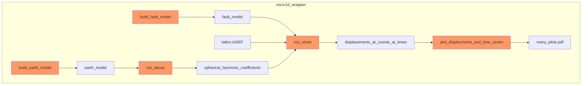

### Wrapper for Visco1d

Visco1D (Pollitz, 1997) computes the time-dependent response of a radially symetric viscoelastic/elastic Earth to imposed fault slip. 

This wrapper uses Python to improve the usability of the Visco1D code. 

### Highly speculative draft of approximate flow control

#### References

Pollitz, Fred F. "Gravitational viscoelastic postseismic relaxation on a layered spherical Earth." Journal of Geophysical Research: Solid Earth 102.B8 (1997): 17921-17941.
